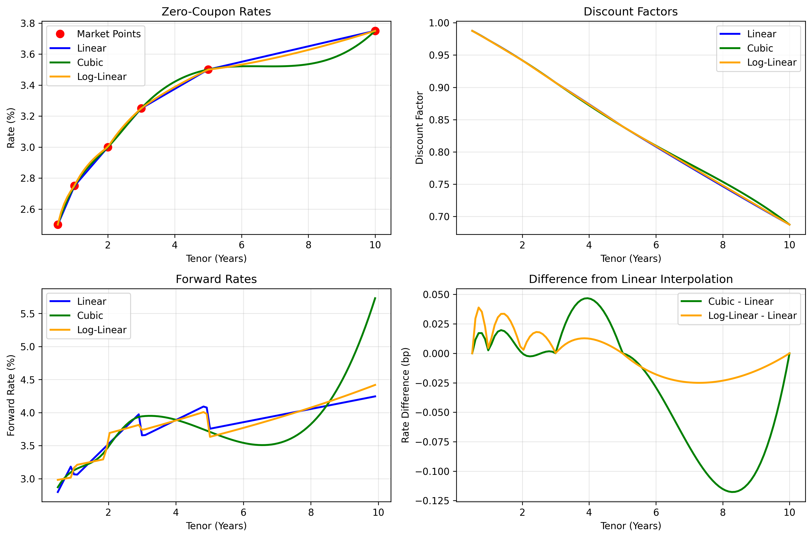

# 📈 Interest Rate Curve Builder

[](https://www.python.org/downloads/)
[](https://streamlit.io/)
[](LICENSE)
[](#testing)

> **A professional-grade library for building and calibrating interest rate curves from market instruments**

Build sophisticated yield curves using various interpolation methods including our innovative **hybrid interpolation** that combines different methods before and after a cutoff date - perfect for real-world applications like SOFR + Swap curve construction.

## ✨ Key Highlights

🔥 **NEW: Hybrid Interpolation** - Mix different interpolation methods (e.g., flat for SOFR rates, cubic for swap rates)  
🎯 **Market-Ready** - Price interest rate futures and swaps with institutional-grade accuracy  
🚀 **Interactive UI** - Beautiful Streamlit dashboard with real-time visualization  
📊 **Advanced Analytics** - DV01, convexity, forward rates, and sensitivity analysis  
🧪 **Thoroughly Tested** - 49 comprehensive tests ensuring reliability  

## 🚀 Quick Start

### Installation
```bash
git clone https://github.com/Alvis42/CurveBuilderToy.git
cd CurveBuilderToy
pip install -r requirements.txt
```

### Launch the Interactive Dashboard
```bash
python3 main.py --streamlit
```
Open your browser to `http://localhost:8501` and start building curves!

### Run the Demo
```bash
python3 main.py --demo
```

## 🎯 Core Features

### 🔀 Advanced Interpolation Methods

| Method | Best For | Description |
|--------|----------|-------------|
| **Hybrid** 🌟 | **SOFR + Swaps** | Different methods before/after cutoff (e.g., flat→cubic) |
| **Flat** | **Central Bank Rates** | Step function - rates stay constant between nodes |
| **Cubic** | **Smooth Curves** | Cubic splines for smooth yield curves |
| **Log-Linear** | **No-Arbitrage** | Preserves positive discount factors |
| **Linear** | **Simple Cases** | Basic linear interpolation |

### 💼 Instrument Support

- **Interest Rate Swaps** - Full pricing with DV01/convexity
- **Interest Rate Futures** - Market-standard pricing
- **Custom Instruments** - Extensible framework

### 📊 Analytics & Risk

- **DV01 (Dollar Value of 01)** - Interest rate sensitivity
- **Convexity** - Second-order price sensitivity  
- **Forward Rates** - Implied future rates
- **Discount Factors** - Present value calculations

## 💡 Real-World Examples

### 🏦 SOFR + Swap Curve (Hybrid Interpolation)

Perfect for building curves where short-term rates follow FOMC policy (flat) and long-term rates are market-driven (smooth):

```python
from src.core.curve import YieldCurve

# Market data: SOFR rates (0-2Y) + Swap rates (2Y+)
tenors = [0.25, 0.5, 1.0, 2.0, 5.0, 10.0, 30.0]
rates = [0.05, 0.051, 0.052, 0.055, 0.058, 0.061, 0.063]

# Hybrid: Flat for SOFR (≤2Y), Cubic for Swaps (>2Y) 
curve = YieldCurve(tenors, rates, 
                  interpolation_method='hybrid',
                  cutoff_tenor=2.0,
                  pre_cutoff_method='flat',    # FOMC policy rates
                  post_cutoff_method='cubic')  # Market swap rates

# Get rates at any tenor
rate_18m = curve.get_rate(1.5)  # Uses flat interpolation
rate_7y = curve.get_rate(7.0)   # Uses cubic interpolation
```

### 💰 Swap Pricing & Risk

```python
from src.core.instruments import IRSwap

# Price a 5-year swap
swap = IRSwap(start=0.0, maturity=5.0, fixed_rate=0.035, notional=1_000_000)

price = swap.price(curve)           # Market value
dv01 = swap.get_dv01(curve)        # $1 per 1bp rate move
convexity = swap.get_convexity(curve)  # Convexity measure

print(f"Swap Value: ${price:,.2f}")
print(f"DV01: ${dv01:.2f}")
```

### 🔄 Curve Bootstrapping

```python
from src.core.bootstrapping import CurveBootstrapper
from src.utils.market_data import load_sample_data

# Load market instruments and prices
instruments = load_sample_data()
market_prices = [0.0, 0.0, 0.0, 0.0, 0.0, 0.0]  # Par instruments

# Bootstrap the curve
bootstrapper = CurveBootstrapper()
curve = bootstrapper.bootstrap(instruments, market_prices)

print("Bootstrapped curve:")
for tenor, rate in zip(curve.tenors, curve.rates):
    print(f"{tenor}Y: {rate:.4%}")
```

## 🎨 Interactive Dashboard

Launch the Streamlit interface for a complete curve building experience:

```bash
python3 main.py --streamlit
```

**Features:**
- 📊 **Real-time visualization** with Plotly charts
- 🎛️ **Interactive controls** for all interpolation methods
- 📈 **Forward rate analysis** and sensitivity plots  
- 💾 **Export capabilities** for data and charts
- 🔧 **Hybrid interpolation builder** with intuitive controls

## 🏗️ Architecture

```
curveBuilder/
├── src/
│   ├── core/                    # Core financial logic
│   │   ├── curve.py            # YieldCurve class with 5 interpolation methods
│   │   ├── instruments.py      # IRSwap, IRFuture pricing
│   │   └── bootstrapping.py    # Curve calibration algorithms
│   ├── utils/                   # Utilities
│   │   ├── market_data.py      # Data handling and sample data
│   │   └── visualization.py    # Plotly-based charting
│   └── ui/
│       └── streamlit_app.py    # Interactive web interface
├── tests/                       # Comprehensive test suite (49 tests)
│   ├── test_curve.py           # Yield curve and instrument tests
│   ├── test_flat_interpolation.py    # Flat interpolation tests
│   ├── test_hybrid_interpolation.py  # Hybrid interpolation tests
│   └── test_swap_pricing.py    # Comprehensive swap pricing tests
├── docs/                        # Documentation and examples
├── data/                        # Sample market data
└── main.py                      # CLI entry point
```

## 🧪 Testing

Run the comprehensive test suite:

```bash
# Run all tests
python3 -m unittest discover tests -v

# Run specific test modules
python3 -m unittest tests.test_hybrid_interpolation -v
python3 -m unittest tests.test_swap_pricing -v

# Or use the CLI
python3 main.py --test
```

**Test Coverage:**
- ✅ 49 tests covering all functionality
- ✅ Core curve building and interpolation
- ✅ Instrument pricing accuracy
- ✅ Bootstrapping algorithms  
- ✅ Edge cases and error handling
- ✅ Hybrid interpolation scenarios

## 📚 API Reference

### YieldCurve Class

```python
class YieldCurve:
    def __init__(self, tenors, rates, interpolation_method='cubic',
                 cutoff_tenor=None, pre_cutoff_method='flat', 
                 post_cutoff_method='cubic')
    
    def get_rate(self, tenor: float) -> float
    def get_discount_factor(self, tenor: float) -> float  
    def get_forward_rate(self, start_tenor: float, end_tenor: float) -> float
```

**Interpolation Methods:**
- `'linear'` - Linear interpolation
- `'cubic'` - Cubic spline interpolation  
- `'log_linear'` - Log-linear on discount factors
- `'flat'` - Step function (flat between nodes)
- `'hybrid'` - Combination of two methods with cutoff

### Instrument Classes

```python
class IRSwap:
    def price(self, curve: YieldCurve) -> float
    def get_dv01(self, curve: YieldCurve) -> float
    def get_convexity(self, curve: YieldCurve) -> float
    def get_cashflows(self, curve: YieldCurve) -> dict

class IRFuture:
    def price(self, curve: YieldCurve) -> float
    def get_dv01(self, curve: YieldCurve) -> float
```

## 🔬 Advanced Use Cases

### Multi-Currency Curves

```python
# USD SOFR + Swap curve
usd_curve = YieldCurve(usd_tenors, usd_rates, 'hybrid', 
                      cutoff_tenor=2.0, pre_cutoff_method='flat')

# EUR ESTR + Swap curve  
eur_curve = YieldCurve(eur_tenors, eur_rates, 'hybrid',
                      cutoff_tenor=1.0, pre_cutoff_method='flat')
```

### Custom Interpolation Combinations

```python
# Policy rates (flat) → Market rates (log-linear)
policy_curve = YieldCurve(tenors, rates, 'hybrid',
                         cutoff_tenor=3.0,
                         pre_cutoff_method='flat',
                         post_cutoff_method='log_linear')

# Short smooth → Long flat (unconventional but possible)
custom_curve = YieldCurve(tenors, rates, 'hybrid', 
                         cutoff_tenor=5.0,
                         pre_cutoff_method='cubic',
                         post_cutoff_method='flat')
```

### Sensitivity Analysis

```python
# Parallel shift analysis
base_curve = YieldCurve(tenors, rates, 'cubic')
shock_rates = [r + 0.0001 for r in rates]  # +1bp shock
shocked_curve = YieldCurve(tenors, shock_rates, 'cubic')

swap = IRSwap(0, 10, 0.03)
dv01 = (swap.price(shocked_curve) - swap.price(base_curve)) * 10000
print(f"Swap DV01: ${dv01:.2f}")
```

## 🎓 Understanding Interpolation Methods

### When to Use Each Method

| **Flat Interpolation** | **Cubic Interpolation** | **Hybrid Interpolation** |
|------------------------|-------------------------|--------------------------|
| ✅ Central bank policy rates | ✅ General yield curves | ✅ **SOFR + Swap curves** |
| ✅ SOFR/Fed Fund rates | ✅ Corporate bond curves | ✅ Multi-market segments |
| ✅ Overnight Index Swaps (OIS) | ✅ Government bond curves | ✅ Policy + market rates |
| ✅ Short-term funding curves | ✅ Smooth interpolation needed | ✅ **Real-world applications** |

### Hybrid Interpolation Benefits

🎯 **Perfect for SOFR Construction**: Flat rates between FOMC meetings, smooth swaps  
🔄 **Flexible Transitions**: Any combination of methods at any cutoff  
🏦 **Market Reality**: Reflects how different rate segments actually behave  
⚡ **Seamless**: Smooth transition at cutoff point  

## 🤝 Contributing

We welcome contributions! Here's how:

1. **Fork** the repository
2. **Create** a feature branch (`git checkout -b feature/amazing-feature`)
3. **Add tests** for your changes
4. **Commit** your changes (`git commit -m 'Add amazing feature'`)
5. **Push** to the branch (`git push origin feature/amazing-feature`)
6. **Open** a Pull Request

### Development Setup

```bash
# Clone your fork
git clone https://github.com/yourusername/CurveBuilderToy.git
cd CurveBuilderToy

# Install dependencies
pip install -r requirements.txt

# Run tests to ensure everything works
python3 -m unittest discover tests -v
```

## 📊 Visualization Examples



*Comparison of different interpolation methods showing the unique characteristics of each approach*

## 🎯 Roadmap

- [ ] **Multi-currency support** with FX basis curves
- [ ] **Credit spread curves** for corporate bonds  
- [ ] **Volatility surface** construction
- [ ] **Monte Carlo** simulation capabilities
- [ ] **REST API** for web service integration
- [ ] **Database integration** for market data feeds

## 📝 License

This project is licensed under the MIT License - see the [LICENSE](LICENSE) file for details.

## 🙏 Acknowledgments

- **Streamlit** - For the beautiful web interface framework
- **Plotly** - For interactive financial visualizations  
- **SciPy** - For robust numerical interpolation methods
- **NumPy** - For efficient numerical computations

## 📞 Support & Community

- 🐛 **Issues**: [GitHub Issues](https://github.com/Alvis42/CurveBuilderToy/issues)
- 💬 **Discussions**: [GitHub Discussions](https://github.com/Alvis42/CurveBuilderToy/discussions)  
- 📧 **Contact**: Open an issue for support

---

⭐ **Star this repo** if you find it useful! Your support helps drive development.

**Happy curve building! 📈💰**